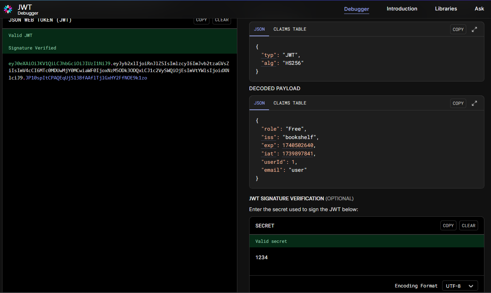

## Java Code Analysis!?!

Log in the website using `user:user`, the goal is to access the flag file

However, when we click on the flag file, it shows that "*You need to have Admin role to access this special book!*"

Open the Firefox Developer Tools, go to Local Storage, and you will see that the authorization process is likely handled by the JSON Web Token (JWT).

Naively, we change the role from Free to Admin and refresh. We indeed see that something has changed.

However, we still cannot access the flag file, which means we are not the real Admin yet. We need to enter the correct JWT token.

Copy and paste the current auth token into a JWT decoder.

We notice that a secret key is missing. If we go to src/main/java/io/github/nandandesai/security/SecretGenerator.java, we can see that the secret signature is simply '1234'.

Indeed, when we enter this signature, the verification passed. 

Now, we change the role to Admin and try again with our new auth token.

Still does not work ...

We also try changing the userId to 2 and then try again.

This time we become Admin and can read the flag!

