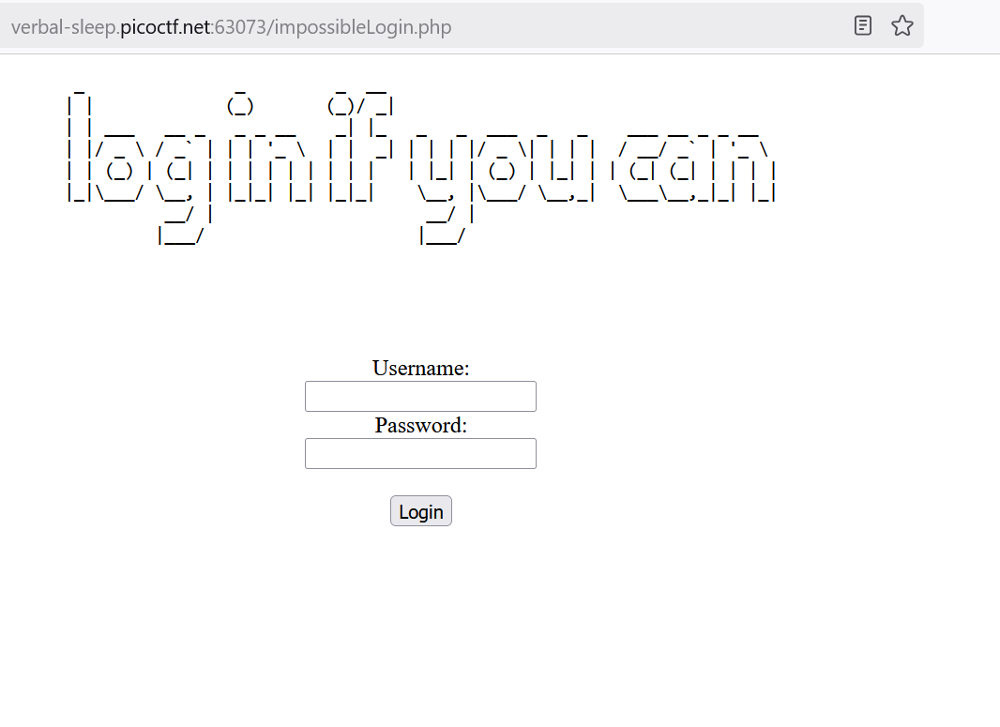
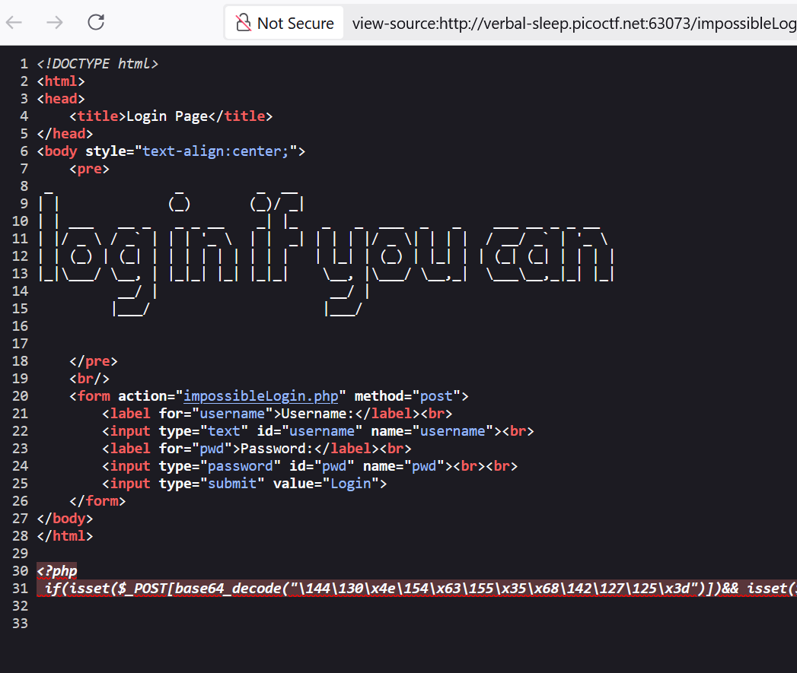
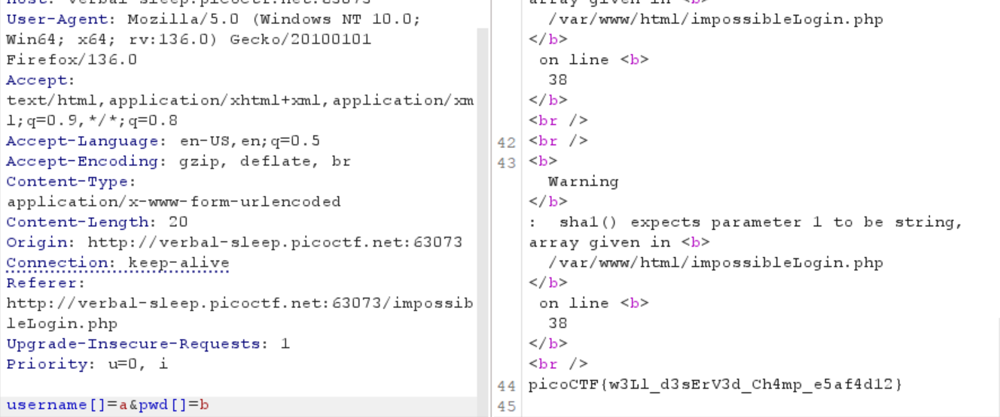

Go to the login page



According to the hint of this CTF, we search the backup file such as .backup, .bak, ~ etc. 

Adding ~ after the extension, we find some extra information



We see a one-line php code, after formatting it, we get

```
<?php
if (
    isset(
        $_POST[
            base64_decode("\144\130\x4e\154\x63\155\x35\x68\142\127\125\x3d")
        ]
    ) &&
    isset($_POST[base64_decode("\143\x48\x64\x6b")])
) {
    $yuf85e0677 =
        $_POST[base64_decode("\144\x58\x4e\154\x63\x6d\65\150\x62\127\x55\75")];
    $rs35c246d5 = $_POST[base64_decode("\143\x48\144\153")];
    if ($yuf85e0677 == $rs35c246d5) {
        echo base64_decode(
            "\x50\x47\112\x79\x4c\172\x35\x47\x59\127\154\163\132\127\x51\x68\111\x45\x35\166\x49\x47\132\163\131\127\x63\x67\x5a\155\71\171\111\x48\x6c\166\x64\x51\x3d\x3d"
        );
    } else {
        if (sha1($yuf85e0677) === sha1($rs35c246d5)) {
            echo file_get_contents(
                base64_decode(
                    "\x4c\151\64\166\x5a\x6d\x78\x68\x5a\x79\65\60\145\110\x51\75"
                )
            );
        } else {
            echo base64_decode(
                "\x50\107\112\171\x4c\x7a\65\107\x59\x57\154\x73\x5a\127\x51\x68\x49\105\x35\x76\111\x47\132\x73\131\127\x63\x67\x5a\155\71\x79\x49\110\154\x76\x64\x51\x3d\75"
            );
        }
    }
} ?>
```

There is some encoding in the php code above, which involves both hex and oct. Put it in hex and oct decoder and do base64 decode, we get 

```
<?php
if (
    isset($_POST["username"]) && isset($_POST["pwd"])
) {
    $yuf85e0677 =
        $_POST["username"];
    $rs35c246d5 = $_POST["pwd"];
    if ($yuf85e0677 == $rs35c246d5) {
        echo "<br/>Failed! No flag for you";
    } else {
        if (sha1($yuf85e0677) === sha1($rs35c246d5)) {
            echo file_get_contents(../flag.txt);
        } else {
            echo "<br/>Failed! No flag for you";
        }
    }
} ?>
```

This seems impossible to get the flag, since we need to have the condition $yuf85e0677 == $rs35c246d5 to be false, but sha1($yuf85e0677) === sha1($rs35c246d5) to be true. Although, the sha1 collision has been proved to be true, see e.g. https://arstechnica.com/information-technology/2017/02/at-deaths-door-for-years-widely-used-sha1-function-is-now-dead/
I don't think this is the goal of the CTF. Another way is to use burpsuite and modify our post request to make our inputs to be array, but sha1(array) will return NULL so sha1($yuf85e0677) === sha1($rs35c246d5) will become NULL === NULL, which is true. 



The method indeed works and we get the flag. 

